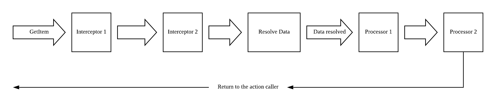

# Resource Piper
Resource Piper is a tool aims to reduce the repetition code of get/create/update/delete resource from the server.

## Introduction
Workflow of resource piper

Here are the definitions of some key components in the above diagram:
* Action: a action is a function used to manipulate the resource. When a action is called, a promise will be returned to the action caller. Below are the built-in actions:
  * GetItem: get a specific item.
  * ListItems: List a bunch of items.
  * CreateItem: create item.
  * UpdateItem: update item.
  * DeleteItem: delete item.

  Execept the built-in function, you can always define your own one with the `defineAction` method.

* Interceptor: interceptor can be used to intercept the action before it goes to the resolver. This can be very helpful if you want to implement some kind of caching features in the browser.
* Resolver: a resolver is a function used to resolve the data. You can define resolver per resource or define a generic resolver for a bunch of resources.
* Processor: after the data is resolved, the resolved data will go directly to the processors. You can make use of processor to store the resolved data to some external storages, like redux store/mobx/localStorage, etc. It is the processor that determines what should be returned to the action caller. If you doesn't specify any processor for a resource, a default processor which will return the resolved data from the server to the action caller will be used.

## Usage
```javascript
import resourcePiper from 'resource-piper'

const myDataPipe = resourcePiper.new({
  server: 'https://my.awesome.apis/v1'
})

// interceptor is used to intercept the action before it goes to the resolver.
myDataPipe.addInterceptor(resourceName, (action, pipe, next, ...others) => {
  // action is an object with id, name and payload attributes.
  // id is a string generated by resourcePiper to identify each action.
  // e.g. https://my.awesome.apis/v1/users+getItem+query=name=@taven
  // name is the name of this action, e.g. getItem/ListItems etc.
  // payload is the payload for this action, e.g. {query: name=@taven, body: {a:1}}

  // pipe is the current pipe object.

  // next function must be invoked to continue the execution of the pipe.
  // If you want to exit the pipe immediately,
  // you can return a value without invoking the next function.

  // others is the rest of arguments needed to be passed to next interceptor or the resolver.

  // an example of an interceptor implementing the caching feature
  if (actionCache.contains(action.id) && !action.payload.force) {
    // if this action has already been executed and this is not a forced action, the previous result will be return directly.
    return actionCache[action.id]
  }

  // Notes: you don't need to pass the actionId, action and next to this function
  // because it will be populated by the resourcePiper automatically.
  return next()
})

// resolver is the function used to resolve the resource specified in the action.
myDataPipe.addResolver(resourceName, async (action, defaultResolver, pipe, ...others) => {
  // action is the current ongoing action
  
  // defaultResolver is the default resolver generated by resource piper for this resource
  
  // pipe is the current pipe

  // next

  // others

  // an example of resolving the getItem('factory', {name: 1}) action
  const factory = await defaultResolver()
  const creatorId = factory.creator

  const creator = await pipe.getItem('user', creatorId)

  // replace the creator attribute of factory with an user entity
  factory.creator = creator

  // the factory will go directory to the processor
  return factory
})

// processor is used to process the resolved resource
myDataPipe.addProcessors(resourceName, (resolvedResource, pipe, next, ...others) => {
  // normalize the resources
  const entities = normalize(resolvedResource)
  
  // dispatch a action to store entities to redux store
  store.dispatch(storeData({ entities}))

  return next()
})

// you can listen the events going on the pipe, e.g. listen for error
myDataPipe.listen('error', resourceName, (error, action, next) => {
  console.error('an error has occurred!', action, error)

  next(error)
})
```
## The pipe object
The pipe object has some additional attributes except the upper functions:
* ongoingActions: ongoingActions is a map of ongoing actions. The key is the actionId and the value is the promise related to this action.
